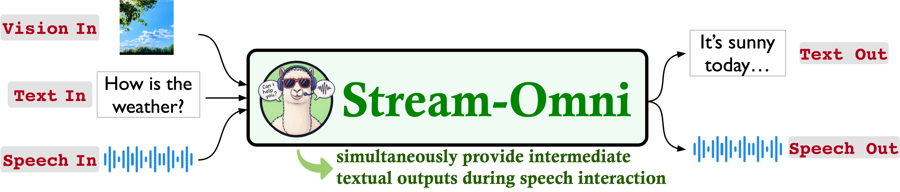

# 🎤 Stream-Omni Voice Interaction System

基于Stream-Omni多模态大语言模型的实时语音交互系统，集成了TEN框架、Fish Speech TTS、Whisper ASR等先进技术。

## ✨ 主要特性

- 🗣️ **实时语音交互**: 支持连续对话，自然的语音交互体验
- 🤖 **多模态AI**: 集成Stream-Omni 8B模型，支持文本和语音的智能交互
- 🎵 **高质量TTS**: 使用Fish Speech进行语音合成，支持音色克隆和情感表达
- 🎯 **智能语音识别**: 集成Whisper large-v3模型，支持中文语音识别
- 🔧 **TEN框架**: 使用TEN VAD和Turn Detection进行智能语音处理
- 💻 **现代化界面**: 基于Vue3的响应式Web界面

## 🏗️ 系统架构

```
用户语音 → TEN VAD → Whisper ASR → LM Studio LLM → Fish Speech TTS → 语音输出
```

<p align="center" width="100%">

</p>

## 🚀 快速启动

### 1️⃣ 启动后端服务
```bash
python start_backend.py
```

### 2️⃣ 启动前端界面
```bash
cd frontend
npm run dev
```

### 3️⃣ 访问系统
- **前端界面**: http://localhost:5174
- **后端API**: http://localhost:8002

## 📋 环境要求

- **Python**: 3.9+
- **Node.js**: 16+
- **GPU**: CUDA支持 (推荐)
- **内存**: 16GB+
- **存储**: 足够空间存放AI模型

## 🎯 核心功能

### 🎤 语音交互
- 实时语音识别和合成
- 支持语音中断和重新开始
- 自然的对话轮次管理

### 🤖 AI对话
- 基于LM Studio的大语言模型
- 支持情感和语调控制
- 智能的上下文理解

### 🎵 语音合成
- Fish Speech高质量TTS
- 温婉女声音色克隆
- 丰富的情感表达标记

## 📁 项目结构

```
streem-omni/
├── simple_voice_server.py     # 主要后端服务
├── fish_audio_tts_wrapper.py  # TTS包装器
├── start_backend.py           # 后端启动脚本
├── frontend/                  # Vue3前端应用
├── models/                    # AI模型文件
├── assets/                    # 音频样本
└── docs/                      # 项目文档
```

详细结构说明: [PROJECT_STRUCTURE.md](PROJECT_STRUCTURE.md)

## ⚙️ 配置要求

### LM Studio
- 地址: `http://localhost:1234`
- 模型: 兼容的大语言模型 (如Qwen系列)

### 模型文件
- **Stream-Omni**: `models/stream-omni-8b/`
- **Fish Speech**: `models/fish-speech/`
- **Whisper**: `models/whisper/`

## 🎮 使用指南

1. **🎤 语音模式**: 点击麦克风按钮开始语音交互
2. **💬 文本模式**: 在输入框中输入文本进行对话
3. **🔄 模式切换**: 随时在语音和文本模式间切换
4. **⏹️ 中断功能**: 支持在AI说话时中断并重新开始

## 🛠️ 开发信息

- **主服务**: `simple_voice_server.py` - WebSocket语音交互服务
- **TTS引擎**: `fish_audio_tts_wrapper.py` - Fish Speech包装器
- **前端**: `frontend/src/` - Vue3组件和页面
- **扩展**: `extensions/` - TEN框架扩展组件

## 📊 性能特性

- ⚡ **实时处理**: 流式音频传输和处理
- 🚀 **低延迟**: 优化的音频处理管道
- 🎯 **高质量**: Fish Speech自然语音合成
- 🧠 **智能检测**: TEN VAD和Turn Detection

## 📖 文档

- [项目结构说明](PROJECT_STRUCTURE.md)
- [语音交互系统指南](docs/Voice_Conversation_System_Guide.md)
- [TEN框架集成指南](docs/TEN_INTEGRATION_GUIDE.md)

## 🤝 贡献

欢迎提交Issue和Pull Request来改进项目！

## 📄 许可证

MIT License - 详见 [LICENSE](LICENSE) 文件
