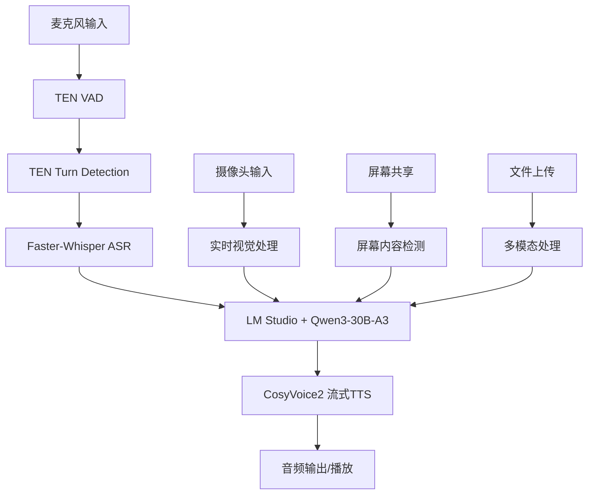

# TEN框架集成架构设计

## 概述

基于TEN框架重构Stream-Omni系统，实现真正的实时语音交互体验。TEN框架提供了完整的实时多模态对话AI代理开发能力。

## 系统架构

### 核心组件



### 技术选型

| 功能模块 | 技术选型 | 说明与优势 |
|---------|---------|-----------|
| 持续唤醒VAD | TEN VAD | 实时轻量，适配macOS，低延迟 |
| 说话轮次检测 | TEN Turn Detection | 控制响应时机，避免抢话，支持全双工对话 |
| 语音识别ASR | faster-whisper | 支持中英文混合，whisper-large-v3-turbo，int8量化 |
| 本地LLM | LM Studio + Qwen3-30B-A3 | 高中文能力，支持长上下文，多轮办公对话 |
| 语音合成TTS | CosyVoice2-300M-SFT | 高质量语音合成，真正的流式推理 |
| 实时视觉 | Stream-Omni-8B | 图像+文本多模态交互 |
| 整体协调 | TEN Framework | 流式管道协调，实时数据处理 |

## 流式管道设计

### 1. 音频输入管道

```python
# 音频输入 -> VAD -> Turn Detection -> ASR
麦克风 -> TEN_VAD -> TEN_Turn_Detection -> Faster_Whisper -> 文本输出
```

**特点:**
- 持续监听，实时VAD检测
- 智能轮次检测，避免误触发
- 中文优化的语音识别

### 2. 多模态处理管道

```python
# 多模态输入 -> 统一处理 -> LLM推理
[文本, 图像, 音频] -> Stream_Omni_Processor -> LM_Studio_API -> 响应文本
```

**特点:**
- 支持图像+文本+语音的多模态输入
- 本地LLM推理，保护隐私
- 长上下文记忆能力

### 3. 音频输出管道

```python
# 文本 -> 流式TTS -> 实时播放
响应文本 -> CosyVoice2_Stream -> 音频块流 -> 实时播放
```

**特点:**
- 真正的流式语音合成
- 边生成边播放，低延迟
- 高质量中文语音

## TEN框架集成方案

### 方案A: TEN Designer可视化配置

使用TEN Designer的低代码/无代码方式：

1. **创建工作流图**
   - 拖拽VAD、ASR、LLM、TTS组件
   - 配置组件参数和连接关系
   - 可视化调试和监控

2. **组件配置**
   ```json
   {
     "vad": {
       "type": "ten_vad",
       "sensitivity": 0.5,
       "min_speech_duration": 0.3
     },
     "asr": {
       "type": "faster_whisper",
       "model": "large-v3-turbo",
       "language": "zh",
       "beam_size": 5
     },
     "llm": {
       "type": "lm_studio",
       "model": "qwen3-30b-a3",
       "api_url": "http://localhost:1234/v1/chat/completions"
     },
     "tts": {
       "type": "cosyvoice2",
       "model": "300m-sft",
       "stream": true,
       "speaker": "中文女"
     }
   }
   ```

### 方案B: Python模块集成

直接使用TEN Framework的Python API：

```python
from ten_framework import TenApp, TenExtension
from ten_vad import VadExtension
from ten_turn_detection import TurnDetectionExtension

class StreamOmniApp(TenApp):
    def __init__(self):
        super().__init__()
        self.setup_pipeline()
    
    def setup_pipeline(self):
        # 添加VAD组件
        self.add_extension(VadExtension())
        
        # 添加Turn Detection组件
        self.add_extension(TurnDetectionExtension())
        
        # 添加ASR组件
        self.add_extension(FasterWhisperExtension())
        
        # 添加LLM组件
        self.add_extension(LMStudioExtension())
        
        # 添加TTS组件
        self.add_extension(CosyVoice2Extension())
        
        # 配置数据流
        self.setup_data_flow()
```

## 实现优势

### 1. 真正的实时性
- **低延迟**: VAD + Turn Detection + 流式TTS
- **全双工**: 支持打断和连续对话
- **实时反馈**: 边说边处理，边生成边播放

### 2. 高质量体验
- **中文优化**: 专门针对中文场景优化
- **多模态**: 支持语音+视觉+文本的综合交互
- **本地化**: 所有处理都在本地，保护隐私

### 3. 可扩展性
- **模块化**: 每个组件都可以独立替换和升级
- **可配置**: 通过TEN Designer灵活配置
- **可监控**: 实时监控各组件性能和状态

## 部署方案

### 开发环境
```bash
# 安装TEN Framework
pip install ten-framework

# 安装各组件
pip install ten-vad ten-turn-detection
pip install faster-whisper
pip install cosyvoice2

# 启动LM Studio
lm-studio serve qwen3-30b-a3

# 运行Stream-Omni
python stream_omni_ten.py
```

### 生产环境
- 使用Docker容器化部署
- 支持GPU加速（可选）
- 负载均衡和高可用配置

## 下一步计划

1. **实现TEN框架兼容的模块**
2. **创建TEN Designer工作流配置**
3. **集成测试和性能优化**
4. **用户界面和体验优化**
