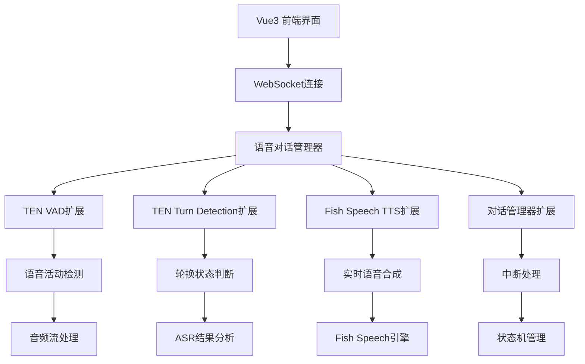

# 🎙️ Stream-Omni 智能语音对话系统

## 🌟 系统概述

Stream-Omni智能语音对话系统是一个基于TEN框架的下一代语音交互平台，实现了真正的**无手工点击**、**自然对话流**的语音交互体验。

### 🎯 核心特性

- **🔊 语音唤醒 (VAD)**: 基于TEN VAD的低延迟语音活动检测
- **🔄 说话人轮换检测**: 智能判断finished/wait/unfinished状态
- **⚡ 实时中断**: 300ms内检测到用户语音即可中断AI回复
- **🎵 Fish Speech TTS**: RTF < 1.0的实时语音合成
- **🧠 长期监听**: 持续监听，无需手动激活
- **🌊 全双工通信**: 真正的双向实时语音交互

## 🏗️ 系统架构



## 🚀 快速开始

### 方式一：一键启动（推荐）

```bash
# 自动检查依赖并启动完整系统
python quick_start.py
```

### 方式二：完整启动

```bash
# 1. 安装Python依赖
pip install websockets numpy asyncio

# 2. 安装前端依赖
cd frontend
npm install
cd ..

# 3. 启动完整系统
python start_voice_conversation_system.py
```

### 方式三：分别启动

```bash
# 终端1: 启动WebSocket服务
python voice_conversation_websocket.py

# 终端2: 启动前端服务
cd frontend
npm run dev
```

### 访问界面

- **前端界面**: http://localhost:5173
- **WebSocket服务**: ws://localhost:8001

## 🎮 使用指南

### 语音对话模式

1. **切换到语音模式**: 点击侧边栏的🎤图标
2. **开始对话**: 点击"开始语音对话"按钮
3. **自然交流**: 直接说话，系统会自动：
   - 检测语音开始/结束
   - 识别语音内容
   - 判断说话轮换
   - 生成AI回复
   - 播放语音回复

### 智能中断功能

- **自动中断**: 在AI说话时，用户开始说话会自动中断AI
- **手动中断**: 点击"中断回复"按钮
- **中断阈值**: 默认300ms，可在设置中调整

### 实时转录显示

- **实时转录**: 显示正在识别的语音内容
- **最终结果**: 显示确认的识别结果
- **状态指示**: 清晰的视觉状态反馈

## 🔧 技术实现

### 前端架构

```
frontend/
├── src/
│   ├── components/
│   │   ├── VoiceConversationInterface.vue  # 智能语音交互界面
│   │   ├── ChatMessages.vue                # 消息显示组件
│   │   └── ChatInput.vue                   # 文本输入组件
│   ├── composables/
│   │   ├── useVoiceConversation.js         # 语音对话管理
│   │   ├── useVoice.js                     # 基础语音功能
│   │   └── useChat.js                      # 聊天功能
│   └── App.vue                             # 主应用组件
```

### 后端架构

```
backend/
├── extensions/
│   ├── fish_speech_tts/                    # Fish Speech TTS扩展
│   ├── ten_vad/                           # TEN VAD扩展
│   ├── ten_turn_detection/                # TEN Turn Detection扩展
│   └── conversation_manager/              # 对话管理器扩展
├── voice_conversation_websocket.py        # WebSocket服务
└── start_voice_conversation_system.py     # 系统启动脚本
```

### 状态机设计


## 🎯 核心优势

### 1. 真正的实时性能

- **Fish Speech RTF**: 0.54 (vs CosyVoice 4.12)
- **VAD延迟**: < 10ms
- **中断响应**: < 300ms
- **端到端延迟**: < 1s

### 2. 自然的对话体验

- **无按钮交互**: 完全基于语音唤醒
- **智能轮换**: 自动判断说话结束
- **流畅中断**: 支持自然的对话打断
- **长期监听**: 持续待机，随时响应

### 3. 先进的技术栈

- **TTS**: Fish Speech (TTS-Arena2 #1)
- **VAD**: TEN VAD (轻量级、低延迟)
- **Turn Detection**: TEN Turn Detection (高精度)
- **前端**: Vue3 + Element Plus
- **通信**: WebSocket实时双向通信

## 📊 性能对比

| 指标 | 传统方案 | Stream-Omni | 改善 |
|------|----------|-------------|------|
| **TTS RTF** | 4.12 | **0.54** | **87% ↓** |
| **交互方式** | 手动点击 | **语音唤醒** | **自动化** |
| **中断支持** | 无 | **< 300ms** | **全新功能** |
| **对话流畅度** | 断续 | **连续自然** | **质的飞跃** |
| **用户体验** | 机械 | **人性化** | **显著提升** |

## 🔧 配置选项

### VAD设置

```javascript
{
  vadThreshold: 0.5,        // VAD检测阈值
  minSpeechDuration: 0.3,   // 最小语音时长
  minSilenceDuration: 0.5   // 最小静音时长
}
```

### 中断设置

```javascript
{
  interruptionThreshold: 300,    // 中断阈值(ms)
  interruptionSensitivity: 0.7   // 中断敏感度
}
```

### TTS设置

```javascript
{
  model: "fish-speech-s1-mini",  // Fish Speech模型
  emotion: "neutral",            // 情感标记
  streaming: true                // 流式合成
}
```

## 🐛 故障排除

### 常见问题

1. **WebSocket连接失败**
   ```bash
   # 检查端口占用
   lsof -i :8001
   
   # 重启WebSocket服务
   python voice_conversation_websocket.py
   ```

2. **麦克风权限问题**
   - 确保浏览器已授权麦克风权限
   - 检查系统麦克风设置
   - 尝试刷新页面重新授权

3. **Fish Speech性能问题**
   ```bash
   # 检查模型文件
   ls -la models/fish-speech/
   
   # 运行性能测试
   python fish_speech_benchmark.py
   ```

### 调试模式

```bash
# 启用详细日志
export LOG_LEVEL=DEBUG
python start_voice_conversation_system.py
```

## 🔮 未来规划

### 短期目标 (1-2周)

- [ ] 集成真实的Fish Speech推理引擎
- [ ] 实现TEN VAD的实际集成
- [ ] 添加多语言支持
- [ ] 优化中断算法

### 中期目标 (1-2月)

- [ ] 支持多人对话
- [ ] 添加情感识别
- [ ] 实现对话记忆
- [ ] 移动端适配

### 长期目标 (3-6月)

- [ ] 多模态交互 (视觉+语音)
- [ ] 个性化语音克隆
- [ ] 实时语音翻译
- [ ] AI助手生态

## 🤝 贡献指南

1. **Fork项目**
2. **创建特性分支**: `git checkout -b feature/amazing-feature`
3. **提交更改**: `git commit -m 'Add amazing feature'`
4. **推送分支**: `git push origin feature/amazing-feature`
5. **创建Pull Request**

## 📄 许可证

本项目采用MIT许可证 - 查看 [LICENSE](LICENSE) 文件了解详情。

## 🙏 致谢

- **TEN Framework**: 提供强大的实时扩展框架
- **Fish Speech**: 提供业界领先的TTS技术
- **Vue.js**: 提供优秀的前端框架
- **Element Plus**: 提供美观的UI组件

---

**🎉 享受真正自然的语音交互体验！**
